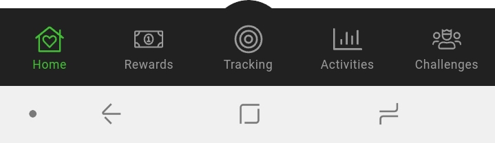
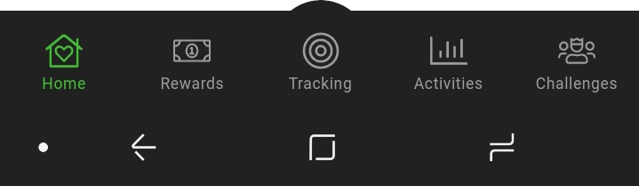

I'm developing a mobile application with Ionic 4 right now.
And it's an application with a tab bar at the bottom of the screen.
And the tab bar background is not white, but almost black (`#212121`).
And on Android with the Navigation Bar at the very bottom, it looks ugly.

Like this (it's Samsung S8, but the other Androids differ only by button configuration):




So, for a couple of weeks, I was looking for a Cordova plugin to change the Navigation bar color.
I knew it was possible because I've seen a bunch of apps that are changing it,
even make it translucent and showing content underneath.

At some point, I found a mention of a such plugin
([cordova-plugin-bartinter](https://libraries.io/github/developingwild/cordova-plugin-bartinter)),
but it was not available anymore (what can be the reason for removing it?).

And today I finally found what I was looking for:
[cordova-plugin-navigationbar-color](https://github.com/fagundes/cordova-plugin-navigationbar)

As you can see, the problem with it is clearly the missing description. Otherwise, it's working great:




## How to use it

Install the plugin in your Ionic project:
```
$ ionic cordova plugin add cordova-plugin-navigationbar-color
```

Add the desired color in your `config.xml`;

```
<plugin name="cordova-plugin-navigationbar-color" spec="0.0.8" />
<preference name="NavigationBarBackgroundColor" value="#212121" />
```

And that's it!

## You should know

This plugin is not changing the color of the Navigation Bar during the Splash screen.
I didn't find how to change it yet.


## One more thing

There's a package for Ionic, that gives you the ability to change the NavBar color from the application,
using the same plugin but I haven't tested it yet.

[Ionic Plugin: Navigation Bar Color](https://github.com/armespavong/ionic-plugin-navigation-bar-color)
