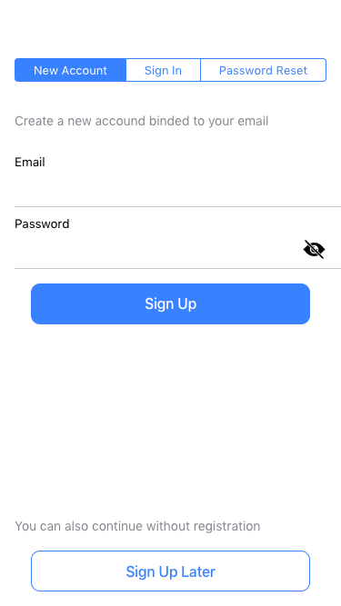

Still working on the new application and one of the first things the user is interacting with is the authorization dialog.

Initially got a complex scheme in the wireframes with several buttons leading to different interfaces for Signing Up, In, Later (anonymous login) and a password reset.

Decided to simplify the interface a bit, putting on top a selector what is the current action and the anonymous login at the very bottom of the page.

Not sure it'll stay like this in this application, but for my own apps, I'll use this layout for sure.

